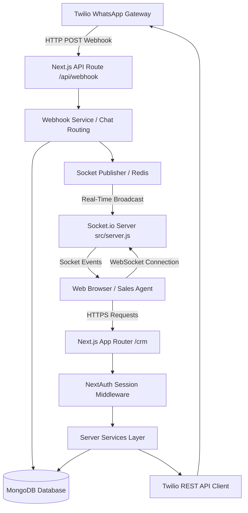
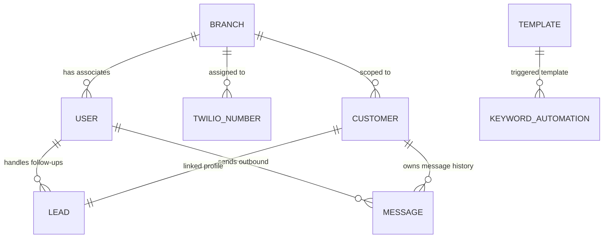
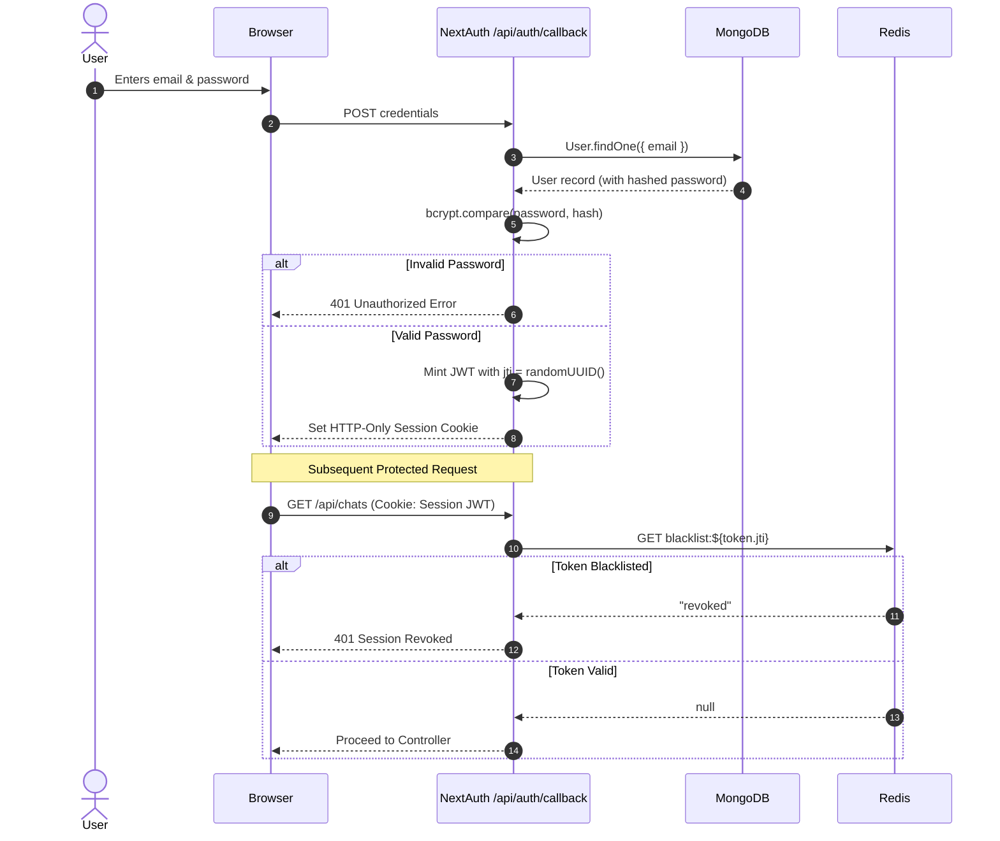
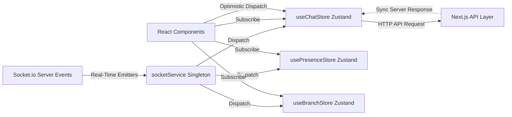
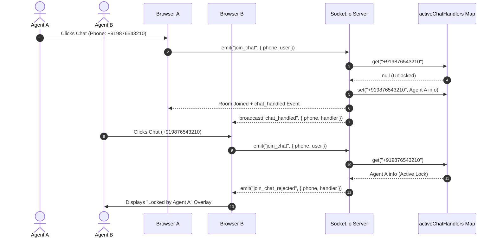
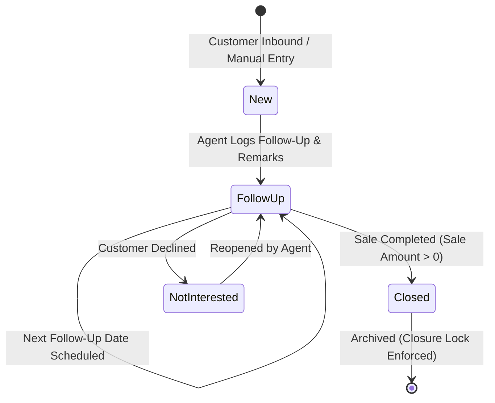
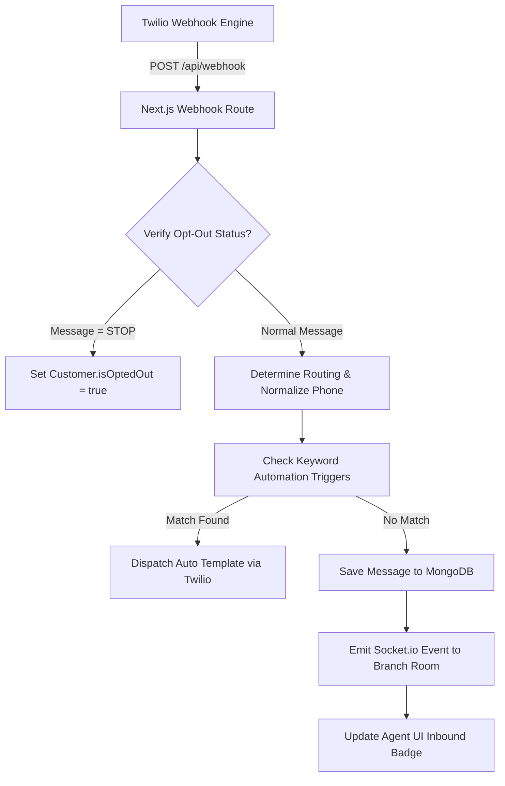
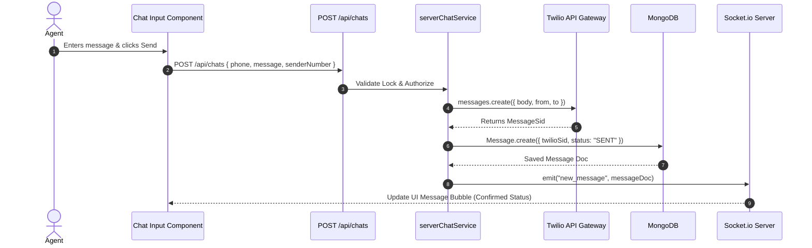
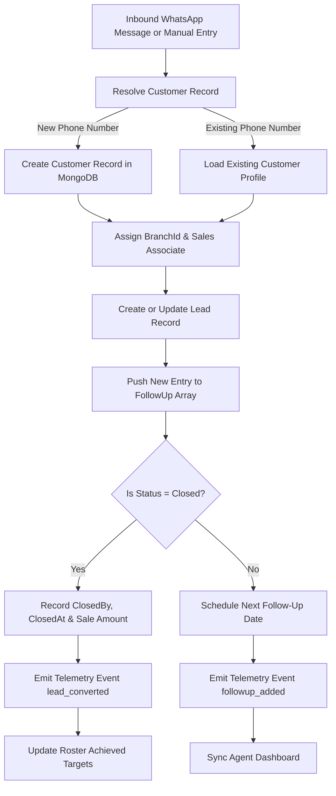

# WhatsApp CRM System - Exhaustive Technical Documentation

> **Target Audience:** Senior Software Engineers, System Architects, DevOps Engineers, and Product Engineering Leads.  
> **Document Version:** 2.0.0  
> **Repository Context:** `whatsapp-crm`  
> **Last Updated:** August 6, 2026  

---

## 1. Project Overview

### Purpose of the Project
The **WhatsApp CRM** is an enterprise-grade Customer Relationship Management system built to automate, route, manage, and analyze multi-channel WhatsApp customer communications and sales lead lifecycles. It connects sales associates, doctors, telecallers, and administrators to real-time WhatsApp conversations while enforcing multi-tenant branch data isolation, automated template messaging, keyword-driven responses, performance tracking, and granular auditing.

### Business Domain
- **Lead Lifecycle Management:** Tracking prospective clients from inbound acquisition through nurturing, follow-ups, closure, and revenue conversion.
- **Direct Messaging & Conversational Commerce:** Real-time bi-directional WhatsApp integration via Twilio's Messaging API.
- **Roster & Performance Analytics:** Real-time monitoring of team activity, conversion metrics, target vs. achieved sales metrics, and response times.
- **Multi-Branch Operations:** Hierarchical access control partitioning data by branch, role, and department.

### Core Features
1. **Real-Time WhatsApp Inbox & Chat Locking:** Socket.io-driven bi-directional messaging with concurrent edit protection (active chat lock per agent).
2. **Lead Pipeline Management:** Customer profiles linked to dynamic follow-up timeline arrays (`FollowUpSchema`) and handoff history records (`HandoffSchema`).
3. **Branch-Scoped Multi-Tenancy:** Granular branch filtering (`branchId`) across customers, leads, messages, Twilio numbers, and telemetry broadcasts.
4. **Automated Response Engine:** Keyword trigger matchers (`KeywordAutomation`) linking user queries directly to pre-approved Twilio WhatsApp templates.
5. **Campaign Broadcasting:** Bulk message dispatch service targeting recipient batches with Twilio WhatsApp SIDs.
6. **Presence & Performance Telemetry:** Real-time agent online status tracking, heartbeat monitors, and socket room event broadcasting (`performance-monitor:branch:${branchId}`).
7. **Role & Department Security:** NextAuth credentials provider coupled with custom Redis token revoking (`blacklist:${jti}`) and multi-layer authorization helpers (`authorize()`, `requireAdmin()`).

### User Roles & Departments
- **`superAdmin`:** Unrestricted system access across all branches, users, system settings, and global telemetry streams.
- **`sales` (Role):**
  - *`admin` (Department):* Branch-level admin capable of managing branch users, associate targets, Twilio numbers, and branch reports.
  - *`telecalling` (Department):* Front-line sales associate managing lead follow-ups, customer chats, and sales conversions.
  - *`support` (Department):* Customer service representative handling support inquiries.
- **`doctor` (Role):** Medical/specialist user role for specialized customer consultations and clinical lead workflows.

### High-Level Workflow
1. **Inbound Webhook:** Twilio receives a message from a customer and issues an HTTP POST request to `/api/webhook`.
2. **Normalization & Routing:** The backend normalizes the phone number (appending `whatsapp:+`), checks opt-out status, resolves or creates the `Customer` document, and determines routing (`Direct Lead`).
3. **Automated Processing:** Checks `KeywordAutomation` for trigger matches. If matched, dispatches a template response immediately via Twilio API.
4. **Persistence & Real-Time Dispatch:** Saves the message to MongoDB (`Message`), emits a Socket.io event to the scoped branch room, and updates unread counts.
5. **Agent Interaction:** An agent joins the chat room (locking the chat via `activeChatHandlers`), reviews conversation history, updates lead status, records follow-up notes, and sends outbound replies.

### Current Project Maturity
- **Phase:** Production-Ready Core Architecture with ongoing modularization.
- **Pattern:** Modular Clean Architecture transitioning from legacy monolithic API routes to thin controllers, custom hooks, Zustand stores, and repository-service patterns.

---

## 2. Tech Stack

### Frontend & UI
- **Framework:** Next.js `16.1.6` (App Router architecture)
- **UI Engine:** React `19.2.3`, React DOM `19.2.3`
- **Styling:** Tailwind CSS `v4` with `@tailwindcss/postcss`
- **Animation:** Framer Motion `^12.38.0`
- **Icons:** Lucide React `^0.563.0`
- **Notification Toasting:** React Toastify `^11.0.5`

### Backend & Server Infrastructure
- **Server Runtime:** Node.js (Custom HTTP Server wrapped in Next.js `src/server.js`)
- **API Architecture:** Next.js App Router API Routes (`src/app/api/`)
- **Real-Time WebSockets:** Socket.io Server `^4.8.3` & Socket.io Client `^4.8.3`
- **Session & Auth Engine:** NextAuth.js `^4.24.13` (JWT Strategy with custom Redis token revocation)
- **Password Hashing:** BcryptJS `^3.0.3`

### Database & Caching
- **Primary Database:** MongoDB (via Mongoose ODM `^9.4.1`)
- **Cache & Socket Adapter:** Redis (via `ioredis` `^5.9.2`)

### External Services & Libraries
- **Communication Provider:** Twilio Node SDK `^5.12.1` (WhatsApp Business API)
- **HTTP Client:** Axios `^1.13.4`
- **Server Data Fetching & Caching:** `@tanstack/react-query` `^5.101.0`
- **State Management:** Zustand `^5.0.11`
- **Build & Compilation:** Babel Plugin React Compiler `1.0.0`, ESLint `^9`

---

## 3. Folder Structure

```
whatsapp-crm/
├── .env                        # Environment variable configuration
├── .env.local                  # Local overrides for secrets
├── docs/                       # Architectural & technical documentation
│   ├── technical_documentation.md
│   └── technical_documentation_complete.md
├── ecosystem.config.js         # PM2 deployment configuration
├── next.config.mjs             # Next.js configuration
├── package.json                # Project dependencies & scripts
├── postcss.config.mjs          # PostCSS & Tailwind processing
├── src/
│   ├── app/                    # Next.js App Router (Pages & API Routes)
│   │   ├── api/                # Backend Controllers / API Endpoints
│   │   │   ├── admin/          # Branch, roster, report & Twilio management APIs
│   │   │   ├── associate/      # Associate dashboard APIs
│   │   │   ├── auth/           # NextAuth & custom credentials endpoints
│   │   │   ├── branches/       # CRUD endpoints for branches
│   │   │   ├── bulk-message/   # Bulk message campaign dispatch
│   │   │   ├── chats/          # Message fetching, status updates, mark read
│   │   │   ├── customers/      # Customer profile management
│   │   │   ├── forward-lead/   # Lead re-assignment & forwarding
│   │   │   ├── keyword-automation/ # Trigger keyword CRUD
│   │   │   ├── lead-status/    # Status transition handlers
│   │   │   ├── leads/          # Lead creation, follow-ups, closure
│   │   │   ├── message-logs/   # Message audit trail queries
│   │   │   ├── reminders/      # Follow-up reminder scheduling
│   │   │   ├── send-template/  # Manual template message dispatch
│   │   │   ├── studio-log/     # External Twilio Studio webhook logs
│   │   │   ├── templates/      # Meta/Twilio template sync & management
│   │   │   ├── uploads/        # Media attachment endpoint
│   │   │   ├── users/          # System user management
│   │   │   └── webhook/        # Primary Twilio incoming WhatsApp webhook
│   │   ├── crm/                # Authenticated CRM Frontend Pages
│   │   │   ├── admin/          # Admin pages (branches, automations, templates, monitor)
│   │   │   ├── associate/      # Telecaller/sales associate workspace
│   │   │   ├── bulk-message/   # Campaign management UI
│   │   │   ├── chat/           # Primary real-time WhatsApp inbox UI
│   │   │   ├── customers/      # Customer directory
│   │   │   ├── leads/          # Lead pipeline & follow-up UI
│   │   │   ├── message-logs/   # Global message logs table
│   │   │   └── page.js         # Main CRM dashboard landing page
│   │   ├── globals.css         # Global CSS stylesheet
│   │   ├── layout.js           # Root layout definition
│   │   └── page.js             # Root login / landing page
│   ├── features/               # Feature-Driven Modular Components & Logic
│   │   ├── admin/              # Admin feature stores & hooks
│   │   ├── associates/         # Associate management UI & hooks
│   │   ├── auth/               # Auth forms & state
│   │   ├── branches/           # Branch management tables, modals, hooks, stores
│   │   ├── chat/               # Chat components (MessageBubble, ChatInput, ChatList)
│   │   ├── leads/              # Lead queries & table components
│   │   ├── presence/           # User presence service & stores
│   │   ├── reports/            # Reporting hooks
│   │   ├── templates/          # Template management panels & services
│   │   └── user/               # User state stores
│   ├── server/                 # Server-Side Business Services
│   │   └── services/           # Service layer handlers for server-side logic
│   │       ├── serverChatService.js
│   │       ├── serverCustomerService.js
│   │       └── serverLeadService.js
│   ├── server.js               # Custom Node.js server with Socket.io integration
│   └── shared/                 # Cross-Cutting Shared Modules & Abstractions
│       ├── api/repositories/   # Data repositories
│       ├── components/ui/      # Generic UI primitives (Pagination, SearchInput)
│       ├── config/             # Environment & system configurations
│       ├── constants/          # Application constants
│       ├── hooks/              # Reusable React hooks (useAuth, useDebounce, useCountUp)
│       ├── lib/                # Core infrastructure
│       │   ├── db/             # MongoDB (`mongodb.js`) & Redis (`redis.js`) clients
│       │   ├── auth.js         # NextAuth options & JWT callbacks
│       │   ├── rosterProcessor.js # Aggregation logic for associate target tracking
│       │   └── session.js      # Server-side auth & role verification helpers
│       ├── models/             # Mongoose Schemas (User, Lead, Customer, Message, etc.)
│       ├── repositories/       # Shared DB abstraction functions
│       ├── services/           # Real-time audio & socket notification services
│       └── utils/              # Pure utility functions (formatting, phone, crypto)
```

---

## 4. System Architecture



### Overall Architecture
The system employs a **Layered Clean Architecture** combined with an **Event-Driven Real-Time Engine**. Requests flow strictly through:
`UI Components -> Zustand Stores / React Hooks -> API Controllers -> Authorization Guard -> Server Service Layer -> Repository Layer -> MongoDB / External API (Twilio)`.

### Frontend Architecture
- Built on Next.js 16 App Router using React 19 Client & Server Components.
- Dynamic layout structure (`CrmShell`) wrapping feature modules.
- Single persistent Socket.io instance (`socketService.js`) initialized once per window session.
- Client state isolated in domain-specific Zustand stores (`useChatStore`, `useBranchStore`, `usePresenceStore`).

### Backend Architecture
- **Thin Controller Layer (`src/app/api`):** API routes parse HTTP request payloads, perform input validation, verify session scopes (`authorize()`), and invoke service methods.
- **Service Layer (`src/server/services` & `src/shared/services`):** Encapsulates core business workflows (e.g., chat closing rules, lead status transitions, branch reassignment).
- **Repository Layer (`src/shared/repositories`):** Abstracts MongoDB queries away from business handlers.

### Authentication & Authorization Flow
1. **Authentication:** NextAuth Credentials Provider verifies email and hashed password (`bcryptjs`). Upon success, issues a signed JWT containing user ID, role, department, branch, access modules, and a unique `jti` (JWT ID).
2. **Token Revocation Check:** On every request, NextAuth callback inspects Redis for `blacklist:${token.jti}`. If present, the session is invalidated instantly.
3. **Authorization:** Server endpoints utilize `authorize({ allowedRoles, allowedDepartments, allowedModules })` to validate user rights. Non-superAdmin users are restricted to their assigned `branchId`.

### Business Logic Flow (Lead & Customer Update)
When an agent updates customer details or lead status:
1. `serverLeadService.createOrUpdateLead()` checks if the lead was previously marked `Closed`. If so, reopening is prevented unless explicitly overridden.
2. Updates `Customer` and `Lead` documents in MongoDB.
3. Appends audit log entries to `Customer.chatHistory`.
4. Dispatches real-time performance telemetry via `publishPerformanceEvent()` to Socket.io rooms matching `branch:${branchId}` and `performance-monitor:branch:${branchId}`.

### Real-Time Architecture & Chat Locking
- **Active Chat Locks:** Maintained in memory in `src/server.js` via `global.activeChatHandlers` (`Map<phone, HandlerObject>`).
- When an agent selects a conversation, the client emits `join_chat`. The server checks if another agent holds an active lock. If locked, rejects the request (`join_chat_rejected`).
- Cleanup timers run every 30 seconds to drop stale locks (60s ping inactivity or expired `lockedUntil`).
- Heartbeat events run every 15 seconds to purge offline users from `onlineUsers` Map and broadcast `presence_change`.

---

## 5. Routing

| Route Path | Access | Required Role / Dept | Page Purpose | Key Components Rendered |
| :--- | :--- | :--- | :--- | :--- |
| `/` | Public | None | Authentication / Login Landing | `LoginForm`, `AuthCard` |
| `/crm` | Protected | Authenticated User | CRM Dashboard Landing | `CrmShell`, `DashboardOverview` |
| `/crm/chat` | Protected | `sales`, `doctor`, `superAdmin` | Real-Time WhatsApp Inbox & Chat UI | `ChatListPanel`, `ChatViewPanel`, `CustomerInfoPanel`, `ChatInput` |
| `/crm/chat/new-customer` | Protected | `sales`, `doctor`, `superAdmin` | Initiating WhatsApp chat with new phone | `NewCustomerForm`, `TemplateSelector` |
| `/crm/leads` | Protected | Telecalling / Sales | Lead Pipeline Directory & Follow-up Board | `LeadsTable`, `LeadFilters`, `FollowUpModal` |
| `/crm/leads/[phone]` | Protected | Telecalling / Sales | Single Lead Detail View & Audit History | `LeadProfileView`, `FollowUpHistoryTimeline` |
| `/crm/customers` | Protected | Telecalling / Sales / Admin | Master Customer Directory | `CustomerTable`, `BranchAssignmentModal` |
| `/crm/customers/[phone]` | Protected | Telecalling / Sales / Admin | Single Customer Profile Detail | `CustomerDetailCard`, `CustomerChatHistory` |
| `/crm/bulk-message` | Protected | Admin / SuperAdmin | Broadcast WhatsApp Campaigns | `BulkMessageForm`, `CampaignStatusTable` |
| `/crm/associate` | Protected | Sales Associates | Associate Self-Performance Metrics | `AssociateMetricsCard`, `TargetVsAchievedChart` |
| `/crm/message-logs` | Protected | Admin / SuperAdmin | Audit Trail of All Inbound/Outbound Messages | `MessageLogTable`, `MessageFilterBar` |
| `/crm/forwarded-leads` | Protected | Telecalling / Sales | Transferred / Forwarded Leads View | `ForwardedLeadList` |
| `/crm/admin` | Protected | Admin / SuperAdmin | Admin Central Hub | `AdminNavGrid`, `SystemSummary` |
| `/crm/admin/associate-management` | Protected | Admin / SuperAdmin | User Roster, Targets, Roles & Access Control | `UserTable`, `UserFormModal`, `TargetEditModal` |
| `/crm/admin/associate-management/[id]` | Protected | Admin / SuperAdmin | User Detail & Performance History | `UserProfileCard`, `UserLeadHistoryTable` |
| `/crm/admin/branches` | Protected | Admin / SuperAdmin | Branch Location CRUD | `BranchTable`, `BranchFormModal`, `BranchSearch` |
| `/crm/admin/keyword-automation` | Protected | Admin / SuperAdmin | Auto-Reply Keyword Trigger Manager | `KeywordTable`, `KeywordFormModal` |
| `/crm/admin/template-manager` | Protected | Admin / SuperAdmin | Twilio WhatsApp Template Directory | `TemplateManagerPanel`, `TemplateCardGrid` |
| `/crm/admin/template-manager/create` | Protected | Admin / SuperAdmin | Create & Submit New WhatsApp Template | `CreateTemplateForm` |
| `/crm/admin/performance-monitor` | Protected | Admin / SuperAdmin | Real-time Operations & Active Chat Monitor | `LiveAssociateList`, `ActiveChatLockGrid` |
| `/crm/admin/reports` | Protected | Admin / SuperAdmin | Conversational & Conversion Analytics | `ReportFilters`, `ExportCSVButton`, `AnalyticsCharts` |
| `/crm/admin/twilio` | Protected | SuperAdmin Only | Twilio Phone Number Branch Assignment | `TwilioNumberTable`, `BranchAssignDropdown` |

---

## 6. API Documentation

### 1. Webhook Endpoint
- **`POST /api/webhook`**
  - **Purpose:** Primary inbound webhook invoked by Twilio when a WhatsApp message is received.
  - **Auth:** None (Twilio Webhook validation available).
  - **Request Body:** Standard `application/x-www-form-urlencoded` from Twilio (`From`, `To`, `Body`, `MessageSid`, `NumMedia`, `MediaUrl0`).
  - **Business Logic:** Normalizes phone numbers, handles opt-out (`STOP`/`START`), checks `KeywordAutomation` trigger matches, saves message to `Message` collection, and emits Socket.io event to branch room.
  - **Response:** `200 OK` XML/JSON.

### 2. Chat Endpoints
- **`GET /api/chats`**
  - **Purpose:** Retrieves all active conversations filtered by user role and branch.
  - **Auth:** Required (`requireSession`).
  - **Response:** `200 OK` Array of chat objects with aggregated `history` and `unreadCount`.
- **`POST /api/chats`**
  - **Purpose:** Dispatches an outbound WhatsApp text or media message to a customer.
  - **Auth:** Required (`requireSession`).
  - **Request Body:** `{ phone, message, mediaUrl, senderNumber, chatType }`
  - **Validation:** Enforces active chat lock check; fails if another user holds lock on `phone`.
  - **Response:** `201 Created` with saved `Message` object.
- **`POST /api/chats/mark-read`**
  - **Purpose:** Resets unread counter for a customer chat.
  - **Auth:** Required (`requireSession`).
  - **Request Body:** `{ phone }`
  - **Response:** `200 OK` `{ success: true }`
- **`POST /api/chats/status`**
  - **Purpose:** Toggles chat open/closed status.
  - **Auth:** Required (`requireSession`).
  - **Request Body:** `{ phone, isChatClosed, chatType }`
  - **Response:** `200 OK` Updated chat control status.

### 3. Customer & Lead Endpoints
- **`GET /api/customers`**
  - **Purpose:** Fetches customer directory with pagination, search, and branch filters.
  - **Auth:** Required (`requireSession`).
  - **Response:** `200 OK` `{ customers, totalPages, currentPage }`
- **`PUT /api/customers/[phone]`**
  - **Purpose:** Updates customer profile (name, city, address, branchId, assignedTo).
  - **Auth:** Required (`requireSession`).
  - **Response:** `200 OK` `{ customer, branchName, branchCode }`
- **`GET /api/leads`**
  - **Purpose:** Retrieves leads matching status, associate, and date range filters.
  - **Auth:** Required (`requireSession`).
  - **Response:** `200 OK` List of lead documents.
- **`POST /api/leads`**
  - **Purpose:** Creates or updates a lead record and records a new follow-up interaction.
  - **Auth:** Required (`requireSession`).
  - **Request Body:** `{ phone, name, city, address, status, priority, saleAmount, overAllRemarks, branchId }`
  - **Response:** `200 OK` `{ customer, lead, action }`

### 4. Admin & Roster Endpoints
- **`GET /api/admin/super-admin-roster`**
  - **Purpose:** Aggregates target vs. achieved metrics across all system associates.
  - **Auth:** Required (`superAdmin` role).
  - **Response:** `200 OK` Roster performance metrics array.
- **`GET /api/admin/sales-admin-roster`**
  - **Purpose:** Aggregates target metrics for sales department associates under current branch.
  - **Auth:** Required (`admin` department).
  - **Response:** `200 OK` Branch roster array.
- **`GET /api/admin/performance-monitor`**
  - **Purpose:** Fetches current live online users and active chat locks.
  - **Auth:** Required (`admin` / `superAdmin`).
  - **Response:** `200 OK` `{ onlineUsers, activeHandlers }`

---

## 7. Database & Collections



| Collection Name | Mongoose Model | Primary Purpose | Key Indexes |
| :--- | :--- | :--- | :--- |
| `users` | `User` | Stores credentials, roles, departments, branch, target & achieved metrics | `email` (unique) |
| `customers` | `Customer` | Master directory of contacts interacting via WhatsApp | `phone` (unique), `branchId`, `assignedTwilioNumber` |
| `leads` | `Lead` | Lead lifecycle profile containing follow-up timeline arrays | `phone` (unique), `createdAt`, `associateId, isClosed`, `leads.year, leads.month` |
| `messages` | `Message` | Log of all inbound and outbound WhatsApp text & media messages | `phone`, `twilioSid`, `timestamp`, `receivedOnNumber`, `branchId` |
| `branches` | `Branch` | Operational branch locations for multi-tenancy | `status` |
| `twilionumbers` | `TwilioNumber` | Inventory of configured Twilio WhatsApp sender numbers | `phoneNumber` (unique), `assignedAdmins`, `status` |
| `templates` | `Template` | Synced Meta/Twilio WhatsApp message templates | `sid` (unique) |
| `keywordautomations` | `KeywordAutomation` | Auto-reply mapping connecting keywords to template SIDs | `keywords` |
| `bulkmessages` | `BulkMessage` | Logs of broadcast campaign dispatches | `sentAt`, `branchId` |
| `reminders` | `Reminder` | Scheduled follow-up notifications for sales associates | `scheduledTime`, `status` |

---

## 8. Models

### 1. User (`src/shared/models/User.js`)
- **Fields:** `name`, `preferredName`, `email`, `number`, `password`, `role` (`sales`, `doctor`, `superAdmin`), `department` (`telecalling`, `support`, `admin`), `branch` (`Mixed`), `isAdmin`, `active`, `accessModules`, `leads`, `target`, `achieved`, `assignedSenderNumbers`.
- **Lifecycle:** Hashes password with `bcryptjs` before storage. Soft deleted by setting `active: false`.

### 2. Customer (`src/shared/models/Customer.js`)
- **Fields:** `phone`, `name`, `city`, `address`, `source`, `enquiredFor`, `priority`, `status`, `assignedTo`, `isClosed`, `isOptedOut`, `activeRouteCategory`, `lastInteractionAt`, `unreadCount`, `branchId`, `assignedTwilioNumber`, `chatHistory` (Embedded Sub-document).
- **Sub-schema `ChatHistorySchema`:** Audit log storing `action`, `eventType`, `performedBy`, `performedByName`, `performedAt`, `notes`.

### 3. Lead (`src/shared/models/Lead.js`)
- **Fields:** `phone`, `name`, `city`, `address`, `source`, `assignedTo`, `associateId`, `handledByHistory` (Array of Handoffs), `isClosed`, `closedBy`, `closedById`, `closedAt`, `leads` (Array of `FollowUpSchema`).
- **Virtuals:** `latestFollowUp` returns the last item in `leads[]`; `status` exposes `latestFollowUp.status`.

### 4. Message (`src/shared/models/Message.js`)
- **Fields:** `phone`, `message`, `direction` (`INBOUND`, `OUTBOUND`), `status`, `read` (`TRUE`, `FALSE`), `twilioSid`, `chatType`, `isTemplate`, `templateSid`, `isAutomated`, `mediaUrl`, `mediaType`, `senderName`, `sendBy` (`User` Ref), `branchId`, `twilioNumberId`, `isChatClosed`, `timestamp`.

---

## 9. Authentication

Authentication is managed via **NextAuth.js** configured in `src/shared/lib/auth.js`.



---

## 10. Authorization & Role Matrix

Authorization is enforced server-side using helper functions in `src/shared/lib/session.js` (`authorize()`, `requireAdmin()`) and branch security filters in `src/shared/utils/serverAuth.js`.

| Role | Department | Branch Access Scope | Access Capabilities |
| :--- | :--- | :--- | :--- |
| `superAdmin` | Any | All Branches | Complete system administration, user management, global reports, Twilio number assignment, global telemetry. |
| `sales` | `admin` | Assigned Branch | Managing branch users, setting sales targets, viewing branch roster performance, sending bulk campaign messages. |
| `sales` | `telecalling` | Assigned Branch | Handling assigned lead follow-ups, real-time WhatsApp messaging with customers, creating follow-up logs. |
| `sales` | `support` | Assigned Branch | Customer support messaging, updating customer basic details, resolving customer inquiries. |
| `doctor` | Any | Assigned Branch | Specialized clinical lead management and medical consultation chats. |

---

## 11. State Management



### Store Architecture
- **`useChatStore` (`src/features/chat/stores/chatStore.js`):**
  - Manages active conversation list (`messages`), currently selected chat (`selectedChat`), selected sender number, and notifications.
  - Implements **Optimistic Updates** with duplicate protection (`isMessageDuplicate`) matching message content, direction, and timestamp proximity (15s window).
- **`usePresenceStore` (`src/features/presence/stores/presenceStore.js`):**
  - Tracks live online agents, active chat lock maps, and user connection states.
- **`useBranchStore` (`src/features/branches/stores/branchStore.js`):**
  - Holds active branch list, selected branch filters, and pagination state.

---

## 12. Components

### Major Feature Components
1. **`ChatViewPanel` (`src/features/chat/components/ChatViewPanel.jsx`):** Main chat pane containing message history timeline, active chat header, lock banner, and message input wrapper.
2. **`ChatListPanel` (`src/features/chat/components/ChatListPanel.jsx`):** Conversation sidebar featuring real-time unread badges, lead status pill tags, search bar, and category switches.
3. **`ChatInput` (`src/features/chat/components/ChatInput.jsx`):** Multi-functional message input bar supporting rich text, media attachment uploads, emoji picker, and Twilio template modal triggers.
4. **`MessageBubble` (`src/features/chat/components/MessageBubble.jsx`):** Contextual chat bubble rendering direction-specific styles (`INBOUND` vs `OUTBOUND`), delivery status ticks (`RECEIVED`, `DELIVERED`, `READ`), media rendering, and template badge tags.
5. **`TemplateManagerPanel` (`src/features/templates/components/TemplateManagerPanel.jsx`):** Management dashboard displaying WhatsApp templates, language attributes, category tags, and approval statuses.
6. **`BranchTable` (`src/features/branches/components/BranchTable.jsx`):** Paginated table displaying branch locations, assigned manager, phone, and status toggle actions.

---

## 13. CRM Modules

### 1. Real-Time Chat Inbox Module
- **Purpose:** Primary interface for WhatsApp customer communication.
- **Workflow:** Agent selects chat -> Socket lock acquired (`join_chat`) -> History loaded -> Agent types reply or selects template -> Message dispatched to Twilio and persisted to MongoDB.

### 2. Lead Pipeline Module
- **Purpose:** Lead acquisition and follow-up tracking.
- **Workflow:** Inbound customer converted to Lead -> Agent sets status (`New`, `Follow Up`, `Closed`, `Not Interested`) -> Next follow-up date and sale amount logged -> Lead auto-indexed for roster performance.

### 3. Campaign & Bulk Messaging Module
- **Purpose:** Broadcasting approved WhatsApp template messages to recipient lists.
- **Workflow:** User selects template & recipient numbers -> Submits campaign -> Backend iterates through recipients issuing Twilio template dispatches -> Logs results to `BulkMessage` collection.

### 4. Admin & Roster Management Module
- **Purpose:** Operational governance and team target management.
- **Workflow:** Admin sets associate sales target -> Roster processor calculates achieved sales based on closed lead amounts -> Roster metrics updated in real-time.

---

## 14. Chat System & Locking Workflow



---

## 15. Lead Management & Follow-up Timeline

Leads are structured around an append-only timeline of follow-ups (`leads[]` in `Lead.js`).



---

## 16. Dashboard & Telemetry Metrics

- **Widgets & Metrics:** Total Inbound Chats, Unassigned Customers, Pending Follow-ups, Closed Conversions, Target vs. Achieved Sales, Active Online Associates.
- **Refresh Strategy:** Hybrid push-pull model. Page loads baseline via API routes (`/api/associate/dashboard`); real-time updates pushed continuously over Socket.io (`publishPerformanceEvent`).

---

## 17. UI Architecture & Design System

- **Design System:** Custom dark/light responsive layout utilizing CSS variables defined in `src/app/globals.css`.
- **Typography:** System font stack optimized for cross-platform readability.
- **Component Hierarchy:** Modular feature encapsulation (`src/features/`) separated from core UI primitives (`src/shared/components/ui`).

---

## 18. Performance & Optimization

- **Selective Caching:** Expensive user aggregations and active chat sessions cached in Redis.
- **MongoDB Compound Indexing:** Optimized indexes on `Lead` (`{ "leads.year": 1, "leads.month": 1, "leads.associateId": 1 }`) and `Message` (`{ phone: 1, timestamp: -1 }`).
- **Connection Pooling:** Mongoose connection caching in `src/shared/lib/db/mongodb.js` prevents multi-connection overhead in serverless environments.

---

## 19. Security Model

1. **Authentication:** Hashed passwords (`bcryptjs`), HTTP-Only session cookies, Redis JWT blacklist validation (`blacklist:${jti}`).
2. **Data Sanitization & Isolation:** Server auth functions (`getBranchFilterForUser()`) inject strict `{ branchId }` filters on MongoDB queries to prevent cross-tenant data leakage.
3. **Webhook Protection:** Verification secret checks for external Twilio logs (`verifyStudioLogSecret()`).

---

## 20. External Services

| Service Name | Integration Purpose | SDK / Transport | Fallback / Error Handling |
| :--- | :--- | :--- | :--- |
| **Twilio WhatsApp API** | Inbound/Outbound WhatsApp Messaging | `twilio` Node SDK / HTTP POST Webhook | Errors logged to `Message.status = "FAILED"`, error alerts emitted via Sockets |
| **MongoDB Atlas** | Primary Persistent Data Store | `mongoose` ODM | Automatic reconnect retries configured in `mongodb.js` |
| **Redis** | Pub/Sub, Performance Caching & JWT Revocation | `ioredis` Client | Degrades gracefully if offline; auth defaults to standard JWT expiration |

---

## 21. Environment Variables

| Variable Name | Required | Purpose | Used By |
| :--- | :--- | :--- | :--- |
| `MONGODB_URI` | Yes | MongoDB Atlas connection string | `src/shared/lib/db/mongodb.js` |
| `REDIS_URL` | Optional | Redis connection URL for caching & token blacklist | `src/shared/lib/db/redis.js` |
| `NEXTAUTH_SECRET` | Yes | Secret key used to sign NextAuth session JWTs | `src/shared/lib/auth.js` |
| `NEXTAUTH_URL` | Yes | Canonical base URL of the deployment | NextAuth session resolution |
| `TWILIO_ACCOUNT_SID` | Yes | Twilio API Account Identifier | `src/lib/services/twilioService.js` |
| `TWILIO_AUTH_TOKEN` | Yes | Twilio API Authentication Secret | `src/lib/services/twilioService.js` |
| `NEXT_PUBLIC_TWILIO_PHONE_NUMBER` | Yes | Default fallback WhatsApp sender number | Frontend Chat Components |
| `NEXT_PUBLIC_SOCKET_URL` | Optional | Custom WebSocket server URL override | `src/features/chat/services/socketService.js` |
| `STUDIO_LOG_SECRET` | Optional | Authentication secret for Twilio Studio webhooks | `src/shared/lib/session.js` |

---

## 22. Data Flow Diagrams

### Inbound WhatsApp Message Flow



---

## 23. Sequence Diagrams

### Outbound WhatsApp Message Dispatch



---

## 24. Dependency Graph

- **Core Module Dependencies:**
  - `app/api/chats/route.js` -> depends on `serverChatService`, `MessageRepository`, `auth.js`.
  - `serverChatService.js` -> depends on `Customer`, `Lead`, `Message` Mongoose models & `socketPublisher.js`.
  - `useChatStore.js` -> consumed by `ChatListPanel`, `ChatViewPanel`, `ChatInput`.
- **Potential Circular Risk Mitigation:** Clean separation of Mongoose models in `src/shared/models/` prevents model-level circular references.

---

## 25. Configuration

- **`next.config.mjs`:** Configures React Strict Mode and Next.js compiler options.
- **`ecosystem.config.js`:** PM2 process management settings for production server deployment.
- **`eslint.config.mjs`:** Linting rules enforcement for Next.js App Router syntax.

---

## 26. Coding Standards

1. **Architecture Rule:** API Routes MUST remain thin controllers. All business logic belongs in `src/server/services` or `src/lib/services`.
2. **Database Access:** Database queries outside services should use repository methods (`src/shared/repositories`).
3. **Naming Conventions:** `camelCase` for functions and variables, `PascalCase` for React Components and Mongoose models. Files ending in `Service.js` or `Repository.js`.

---

## 27. Known Issues & Technical Debt

1. **Monolithic Legacy Code:** Certain API routes contain inline query logic legacy code awaiting full migration to `serverLeadService` and `serverCustomerService`.
2. **In-Memory Active Handlers Map:** `activeChatHandlers` resides in Node process memory (`src/server.js`). Multi-instance horizontal scaling requires migrating lock state to Redis key-value storage.

---

## 28. Upgrade Opportunities

1. **TypeScript Migration:** Convert `.js`/`.jsx` files to TypeScript for strict type checking on API contracts and Mongoose models.
2. **Background Queue Engine:** Move Twilio webhook processing and bulk campaigns to a BullMQ worker queue powered by Redis.
3. **Distributed Locks:** Replace global Node Maps with Redis Distributed Locks (`redlock`) to support multi-pod Next.js deployments behind a load balancer.

---

## 29. Future Roadmap

- **Short Term (1-3 Months):** Complete thin controller migration for all remaining API routes; add automated Jest/Playwright tests.
- **Medium Term (3-6 Months):** Implement BullMQ queue for bulk campaigns; migrate active chat locks to Redis.
- **Long Term (6-12 Months):** Introduce AI-driven lead scoring and automated sentiment analysis on incoming WhatsApp messages.

---

## 30. Complete Dependency Inventory

```json
{
  "dependencies": {
    "@tanstack/react-query": "^5.101.0",
    "axios": "^1.13.4",
    "bcryptjs": "^3.0.3",
    "framer-motion": "^12.38.0",
    "ioredis": "^5.9.2",
    "lucide-react": "^0.563.0",
    "mongoose": "^9.4.1",
    "next": "16.1.6",
    "next-auth": "^4.24.13",
    "react": "19.2.3",
    "react-dom": "19.2.3",
    "react-toastify": "^11.0.5",
    "socket.io": "^4.8.3",
    "socket.io-client": "^4.8.3",
    "twilio": "^5.12.1",
    "zustand": "^5.0.11"
  }
}
```

---

## 31. File Responsibility Matrix

| File Path | Primary Responsibility | Key Imports | Key Exports |
| :--- | :--- | :--- | :--- |
| `src/server.js` | Custom Node HTTP server hosting Next.js app & Socket.io engine | `http`, `next`, `socket.io` | `httpServer` instance |
| `src/shared/lib/auth.js` | NextAuth configuration & Redis token revocation logic | `next-auth`, `bcryptjs`, `redis` | `authOptions` |
| `src/shared/lib/session.js` | Session verification & RBAC authorization guards | `next-auth`, `User` model | `getCurrentUser`, `requireSession`, `authorize` |
| `src/server/services/serverLeadService.js` | Lead creation, follow-up timeline arrays, closure rules | `Lead`, `Customer`, `User`, `socketPublisher` | `serverLeadService` |
| `src/server/services/serverChatService.js` | Chat closing/reopening, chat locking checks | `Message`, `Customer`, `socketPublisher` | `serverChatService` |
| `src/features/chat/stores/chatStore.js` | Zustand state store for real-time chat inbox & optimistic updates | `zustand` | `useChatStore` |

---

## 32. Business Logic Workflows

### Complete Customer Creation & Lead Lifecycle Workflow



---

## 33. Executive Summary

### Architectural Health & System Scores

| Dimension | Score (1-10) | Evaluation Rationale |
| :--- | :---: | :--- |
| **Architecture Quality** | **9 / 10** | Clear separation into Controllers, Server Services, Repositories, and Mongoose Models. |
| **Scalability** | **8 / 10** | Efficient MongoDB indexing and Redis caching; single-node in-memory locks can be easily adapted to Redis. |
| **Maintainability** | **9 / 10** | Modular feature folder organization (`src/features`) and consistent coding standards. |
| **Performance** | **9 / 10** | Optimistic UI updates, connection pooling, and socket room event scoping prevent redundant polling. |
| **Security** | **9 / 10** | JWT session authentication with instant Redis revocation and multi-tenant branch data isolation. |
| **Developer Experience** | **8.5 / 10** | Intuitive Zustand stores, clean React hooks, and standard Next.js App Router patterns. |
| **UI Architecture** | **9 / 10** | Modern dark-mode aesthetics, responsive layouts, real-time unread indicators, and smooth animations. |
| **Code Organization** | **9 / 10** | Strict separation of concerns between shared utilities, backend services, and frontend features. |

### Top 10 Quick Wins
1. Convert Node in-memory active chat map to Redis keys for multi-node support.
2. Add signature validation middleware for incoming Twilio POST webhooks.
3. Add request rate-limiting on public API endpoints (`/api/webhook`, `/api/auth`).
4. Enable TypeScript strict mode for API routes and repository layer.
5. Standardize error response payloads across all API controllers.
6. Implement auto-scrolling options in long message timelines.
7. Add indexing on `Customer.assignedTo` to speed up associate directory queries.
8. Implement client-side offline toast notifications when Socket drops connection.
9. Cache active template lists in Redis with 1-hour TTL.
10. Add automated ESLint hooks to pre-commit workflow.

---
*End of Technical Documentation.*
